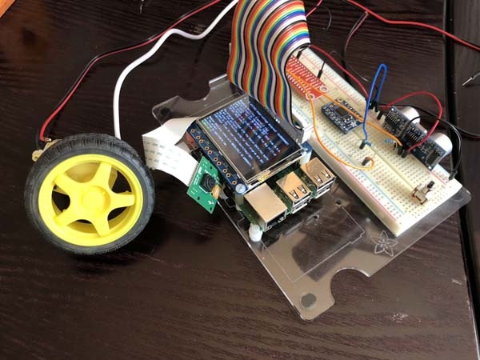

# PatrolBot
Creating a Raspberry Pi controlled two wheeled robot to patrol the house.



The current setup consists of:

* [Raspberry Pi 3 Model B+](https://www.arrow.com/en/products/raspberrypi3b/raspberry-pi-foundation)
* [Raspberry Pi Camera Module](https://www.amazon.com/Raspberry-Pi-Camera-Module-Megapixel/dp/B01ER2SKFS)
* [Adafruit 2.4'' PiTFT](https://learn.adafruit.com/adafruit-2-4-pitft-hat-with-resistive-touchscreen-mini-kit?view=all)
* [Adafruit TB6612 Motor Driver](https://learn.adafruit.com/adafruit-tb6612-h-bridge-dc-stepper-motor-driver-breakout/overview)
* [Kuman RPi GPIO Breakout Expansion Board and Ribbon Cable](https://www.amazon.com/gp/product/B0761NYF6Y)
* [Robotic Platform](https://www.amazon.com/Adafruit-3244-3-Layer-Round-Chassis/dp/B01N0ZWLFG/)

Currently, to drive the PiTFT display the software needs to be run as root in
order to write directly to the frame buffer at `/dev/fb1`:

```bash
$ sudo su
# . ./venv/bin/activate
(venv) # python ./main.py
```

## Prerequisites

This project requires [OpenCV 3.4](https://github.com/opencv/opencv) 
and the [contribution libraries](https://github.com/opencv/opencv_contrib) or 
higher compiled for Python3. The `scripts/build_opencv.sh` is provided to 
help build OpenCV specifically for this project.

To install the pip requirements:

```bash
$ virtualenv ./venv -p python3
...
$ . ./venv/bin/activate
(venv) $ pip install -r ./requirements.txt
```

Now you'll need to copy the `cv2.so` from OpenCV's library to the virtualenv

```bash
$ cp /path/to/opencv/lib/cv2.cpython-35m-arm-linux-gnueabihf.so \
./venv/lib/python3.4/site-packages/cv2.so
```

## Unit Tests

This project uses the Python `unittest` library. To run a single test:

```bash
(venv) $ python -m unittest tests.name_of_unit_tests.TestFixture.test_name
```

where `name_of_unit_tests` matches a file in the `tests/` directory, 
`TestFixture` matches the class name in that file, and `test_name` matches
the member function of `TestFixture` to run.

To run the entire suite of unit tests:

```bash
(venv) $ python -m unittest discover -s tests -p "*_unit_tests.py"
```

## Project Organization

The `patrolbot` library consists of:

* `flask_app/` - Contains an implementation of web UI using Flask
* `gui/` - Contains the onboard GUI implementation using PyGame
* `sensors/camera` - Interface to the Raspberry Pi camera using OpenCV
